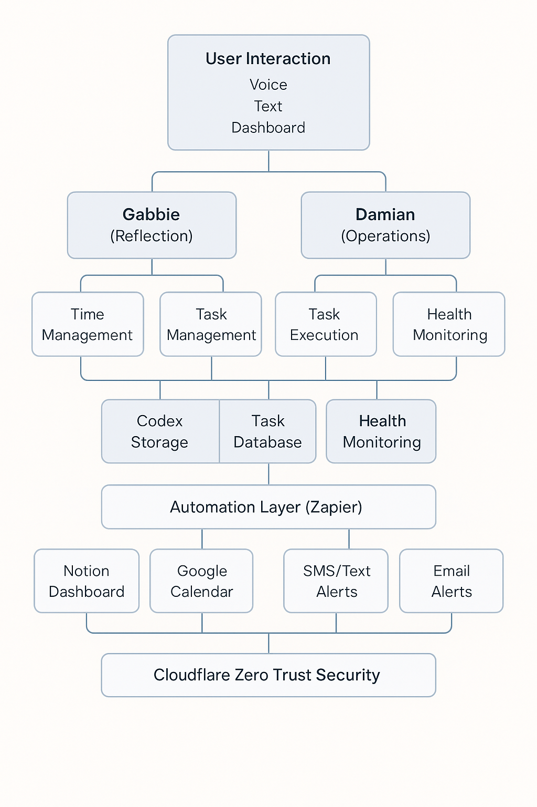

# Comprehensive Specifications Document

# 1. Vision & Purpose

**Mission Statement:**
To build a harmonious life system that cultivates peace, freedom, and happiness through structured time mastery, intentional task execution, and a loving journey inward toward self-awareness and self-compassion.

**Radiant-Core** is a self-management and life-optimization platform designed to:

- Increase the probability of **Peace**, **Freedom**, and **Happiness** in the user's life.
- Serve as the "master system" guiding the execution of best practices across all personal and professional domains.
- Orchestrate intelligent task management, knowledge curation, automation, and self-awareness.
- Seamlessly integrate AI agents (Gabbie and Damian) to assist with cognition, reflection, communication, and execution.

## Core Pillars

- **Time Management** — Creating structure without rigidity.
- **Task Management** — Simplifying execution and honoring priorities.
- **Self-Awareness & Self-Love** — Nurturing personal growth and wholeness.

## Guiding Values

- Self-compassion is a strategy.
- Discipline enables freedom.
- Awareness leads to alignment.
- Automation protects energy.

---

# 2. Architecture

## 2.1 Core Systems

- **Codex System**: Structured knowledge management (People, Projects, Reflections).
- **Task Management Engine**: Centralized and AI-augmented task orchestration.
- **Time Management Engine**: Dynamic planning, scheduling, and realignment.
- **Self-Health Monitor**: Visual dashboard tracking system status (Green/Yellow/Red alerts).
- **Automation Layer**: Primary automation via **Zapier**, expandable into **Make** and **n8n**.
- **Communication Layer**: Internal messaging and alerting system (Text, Email, Voice).
- **Voice Interface**: Real-time voice interaction via Damian and Gabbie.

## 2.2 Data Layers

- **Codex Storage**: Versioned, curated JSON or lightweight database entries.
- **Task Database**: Active, pending, completed tasks with priority, category, timestamps.
- **Health State File**: Live-updated JSON reflecting Radiant-Core subsystem health.
- **System Logs**: Execution, error, and decision logs stored and retrievable.

## 2.3 External Integrations

- **Notion**: For higher-level visualization and user-friendly dashboards.
- **Zapier**: Primary workflow and event automation system.
- **Cloudflare Zero Trust**: Secure remote access to internal APIs.
- **Custom Hosting Environment**: Hosting local AI models replacing LM Studio.
- **ElevenLabs**: Voice synthesis and AI persona vocalizations.

## 2.4 High-Level Architecture Diagram

(Actual graphic to be finalized separately)

---

# 3. Features and Systems

## 3.1 Time Management System

**Tool:** Google Calendar + Notion Planner

**Primary Workflow:**

- Sunday Planning Ritual (30 min).
- Pre-block spiritual, creative, and rest time.
- Protect "golden hours" (deep work window).
- Include buffer zones between appointments.

**Automation Ideas:**

- Recurring calendar blocks for rituals.
- Daily planning prompt to Notion (via Zapier).

## 3.2 Task Management System

**Tool:** Notion or Todoist with Eisenhower Matrix

**Primary Workflow:**

- Task capture → clarify → categorize → schedule.
- 3 priority buckets: Must / Should / Could.
- Max 3–5 key outcomes per day.

**Automation Ideas:**

- Zapier to import emails as tasks.
- Auto-categorize tasks based on tags or keywords.

## 3.3 Self-Awareness & Self-Love System

**Tool:** Notion Journal + Insight Timer App

**Primary Workflow:**

- Morning: "How do I feel? What do I need?"
- Evening: "What went well? What did I learn?"

**Automation Ideas:**

- Daily journal template triggered via Zapier.
- Affirmations via SMS (Twilio + Zapier).
- Weekly mood review pulled from Daylio/API.

---

# 4. Functions

| Function | Description |
| --- | --- |
| **Codex Create/Update/Delete** | Structured knowledge management of people, projects, principles |
| **Task Ingestion and Categorization** | Smart intake of tasks, event triggers, and user-defined goals |
| **Self-Awareness Engine** | Prompts and reflections to improve life alignment |
| **Health State Monitoring** | Continuous status checks and notifications |
| **Voice Response** | Seamless voice interaction with AI agents |
| **Time Management Routines** | Daily, Weekly, Monthly planning workflows |
| **Automation Triggers** | Dynamic, scheduled, and event-driven automations |
| **Archival System** | Vaulted backup of Codices, tasks, logs, and health snapshots |

---

# 5. Technologies and Platforms

- **Node.js**: Primary server-side logic.
- **Express.js**: API layer.
- **WebSocket Server**: Real-time interactions.
- **Python (select services)**: Data grooming and Codex parsing.
- **Custom Local Hosting**: Hosting local AI models (replacing LM Studio).
- **Cloudflared**: Secure tunnel for remote access.
- **Notion API**: Dashboard visualization.
- **Zapier**: Automation orchestrator.
- **ElevenLabs API**: Voice synthesis.

---

# 6. Automation Stack

**Primary Platform:**

- Zapier (priority)

**Expansion Platforms:**

- Make.com (for complex workflows)
- n8n (developer-driven automations)

**Sample Automations:**

| Function | Trigger | Action |
| --- | --- | --- |
| Daily Journal | 7 AM (schedule) | Create Notion entry with prompt |
| Email Task | New email with tag | Create Todoist task |
| Affirmation | Weekly | Send SMS via Twilio |
| Task Review | End of day | Update Notion dashboard |
| Weekly Planning | Sunday 6 PM | Reminder email or calendar block |

---

# 7. Planned Extensions

- **Self-Healing Subsystems**: Automatic attempt at remediation when health checks fail.
- **Codex Vault Archival Engine**: Enterprise-grade secure backups.
- **Extended AI Tools**: Expand Damian and Gabbie capabilities with plug-in modules.
- **Emotion Mapping**: Over time, tracking emotional trends through journaling and task results.
- **Mobile Interface**: Text/Voice quick actions from smartphone.
- **Optimization Reviews**: Regular review and recalibration of systems.

---

# 8. Security and Redundancy

- Cloudflare Zero Trust authentication for external access.
- API Key protection for sensitive endpoints.
- Routine encrypted backups.
- Offline recovery plan with manual Codex restoration.
- Local-first design to preserve data sovereignty.

---

# 9. Progress Report

| Project Undertaking | Status | Notes |
| --- | --- | --- |
| Codex System | 80% Complete | CRUD operations stable, UI improvements pending |
| Task Management Engine | 70% Complete | Core logic done; UI scheduling enhancements needed |
| Time Management Engine | 50% Complete | Block scheduling prototypes in testing |
| Self-Health Monitor | 60% Complete | Dashboard MVP functional; escalation rules WIP |
| Automation Layer (Zapier) | 65% Complete | Basic flows implemented; full grooming automation pending |
| Voice Interface (Damian + Gabbie) | 75% Complete | Text and voice response working; polish and voice tuning needed |
| Custom Hosting Environment | 90% Complete | ChatCPT-J hosting stable; optimizing model performance |
| Cloudflare Zero Trust Setup | 95% Complete | Static IP and tunnel access secured |
| Knowledge Curation System | 55% Complete | Templates functional; dynamic event ingestion in progress |
| Mobile Interface | 10% Complete | Planning phase only |
| Codex Vault Archival Engine | 20% Complete | Initial backup scripts drafted |

---

# 10. Project Management Layer

## Radiant-Core Project Tracker (Notion Database Model)

| Field | Type | Purpose |
| --- | --- | --- |
| Project Name | Text | Major system area or feature (e.g., Codex System) |
| Status | Select (Planned, Active, Stalled, Complete) | Real-time tracking |
| Owner | Select (Gabbie, Damian, Manual) | Assigned ownership or automation |
| Priority | Select (High, Medium, Low) | Focus guidance |
| Due Date | Date | Target delivery date |
| Progress % | Number | Visual indicator of completion |
| Related Tasks | Relation (to Task Database) | Link task-level operations |

**Key Views:**

- Kanban by Status
- Table by Priority
- Calendar by Due Date
- Timeline by Phases

## Ritual Cadence

- **Daily:** 5-minute stand-up check (3 priorities + 1 blocker)
- **Weekly:** 30-minute Deep Review (update % complete, status changes)
- **Monthly:** 60-minute Strategic Alignment session (optimize, recalibrate)

## Automation Examples (Zapier)

- If Progress < 50% after 2 weeks → Auto-tag "Stalled" and send alert
- If Due Date approaching in 7 days and Progress < 90% → Flag "Urgent"
- If Status = Complete → Archive project and prompt reflection

---

> Summary:
Radiant-Core is intended to be a living, breathing extension of the user's best self: an ever-evolving architecture built for sustainability, self-mastery, and joyful living.
> 

---